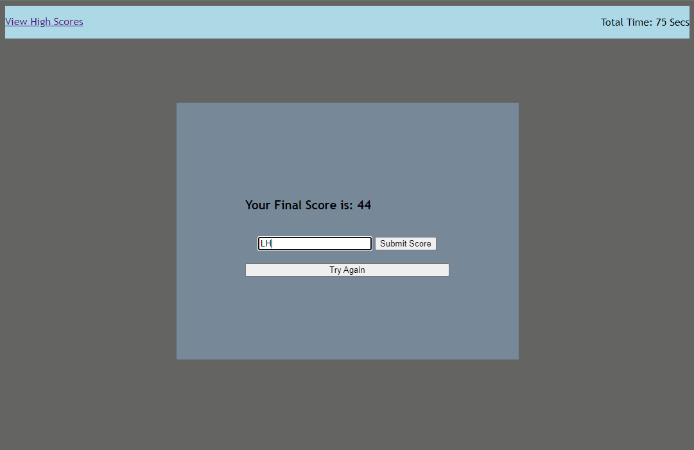

# Multiple Choice Quiz Using JavaScript

## Description
Create a quiz to test coding knowledge using JavaScript

## Functionality
- Click on start to begin quiz
- Questions displayed as well as a timer
- Wrong answer subtracts time from the timer
- If timer gets to 0, or questions are all answered, the quiz ends
- Once quiz finishes, input initials to add score to a high score list
- The upper left includes a link to a second html site where the high scores are listed

## Links
-[Github code link](https://github.com/heintze11/Multiple-Choice-Quiz)

-[Github pages link](https://heintze11.github.io/Multiple-Choice-Quiz/)

## Screenshot

